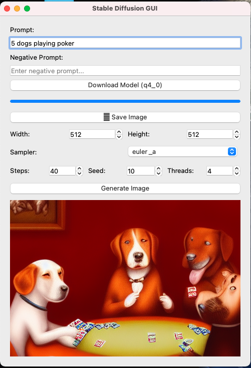

# CDIFF
CDIFF a stable diffusion text to image generator in qt 5.12

https://github.com/leejet/stable-diffusion.cpp makes a binary called sd that i use for this

https://huggingface.co/second-state/stable-diffusion-v1-5-GGUF/resolve/main/stable-diffusion-v1-5-pruned-emaonly-Q4_0.gguf put this in models folder manually if you dont want to download with the app